# MediStruct — Complete System Flow

Every use case, end to end: who does what, which file handles it, and **which data
structure runs at each step**.

> **Viewing:** the diagrams are Mermaid. They render automatically on GitHub, or in
> VS Code with the *Markdown Preview Mermaid Support* extension (`Ctrl+Shift+V`).
>
> Companion docs: [`README.md`](README.md) (setup) · [`DSA.md`](DSA.md) (pseudocode
> + complexity). This file covers **flow** — how the pieces connect.

---

## How to read these diagrams

Every chart uses the same shapes. **Blue hexagons are the data structures** — that
is where a hand-written DSA from `src/lib/dsa/` actually runs:

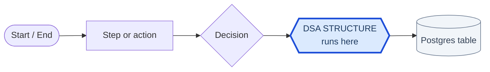

| Shape | Meaning |
|---|---|
| `( rounded )` | Start / end of a journey |
| `[ rectangle ]` | An action or step |
| `{ diamond }` | A decision / branch |
| **`{{ blue hexagon }}`** | **A hand-written data structure running** |
| `[( cylinder )]` | A Postgres table |

---

## 1. The three-layer architecture

Every feature follows this one shape. Understand this and the rest is predictable:

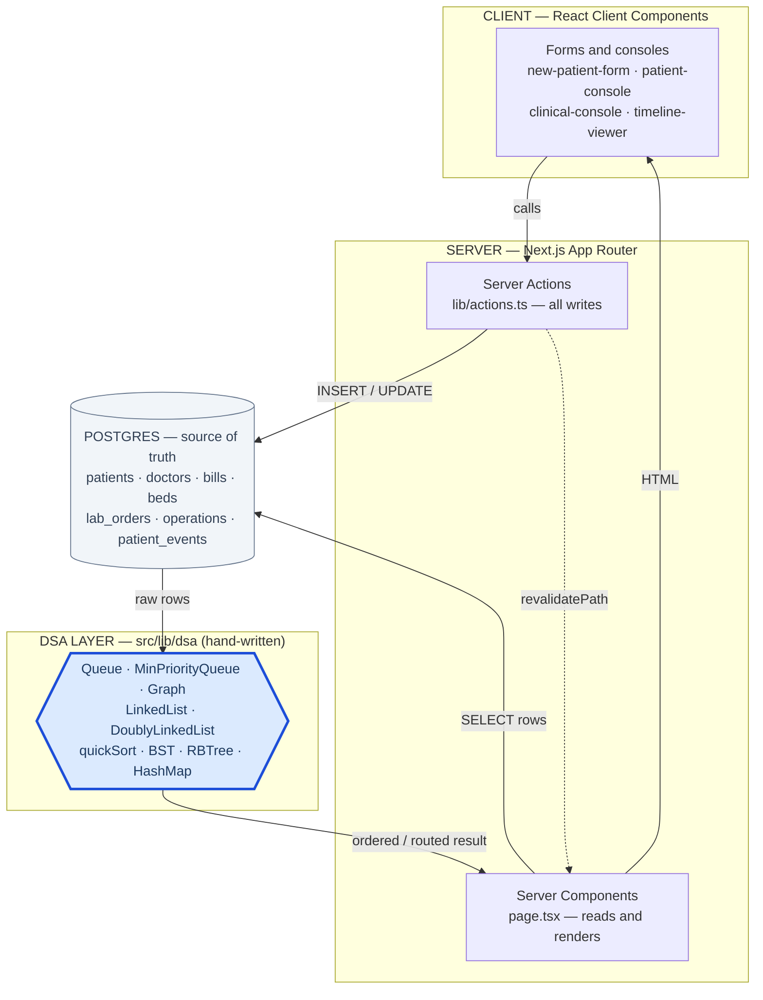

**The key idea — read this line twice:**

> **read rows from Postgres → build a data structure → run its algorithm → render**

The database never sorts, routes, or prioritises. Our own code does. That is what
makes this a DSA project rather than a CRUD app.

---

## 2. Login and role routing

**Files:** `src/app/login/` · `lib/auth.ts` · `lib/session.ts` · `proxy.ts`

There is **no public sign-up** — the admin creates every account. Patients are
*records*, not users.

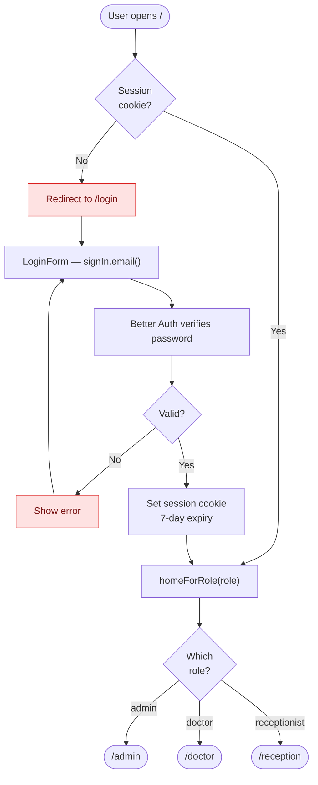

> **DSA used here: none.** Authentication is plain SQL and cookie checks — there is
> nothing to order or route, so no structure is involved.

### The two-gate security model

Authorization is checked **twice**, deliberately:

| Gate | File | Does | Why not enough alone |
|---|---|---|---|
| 1. Optimistic | `proxy.ts` | Checks a cookie *exists*, bounces to `/login` | Never verifies the cookie or the role |
| 2. Authoritative | `requireRole()` | Reads the **verified** session, redirects on wrong role | This is the real check |

`proxy.ts` is Next.js 16's rename of `middleware.ts`. `getCurrentUser()` is wrapped
in React `cache()` so layout and page share **one** session lookup per request.

---

## 3. ADMIN flows

**Route group:** `src/app/(app)/admin/` · **Guard:** `requireRole("admin")`

### 3.1 Admin adds a DOCTOR

The one flow that writes to **two systems** — the domain table and the auth table —
then links them together:

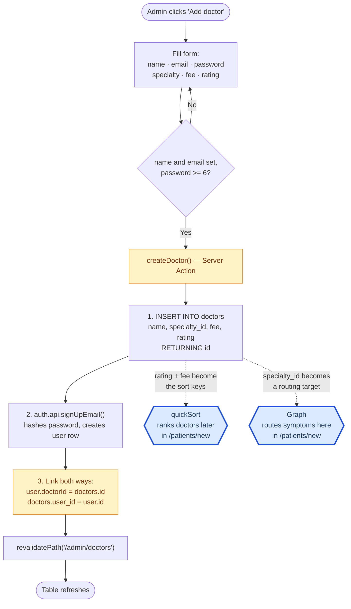

> **DSA used here: none directly — but this flow *feeds* two structures.**
> The three fields the admin types are the **inputs to two algorithms** used later:
> - `rating` + `consultation_fee` → the **quickSort comparator** that ranks doctors
> - `specialty_id` → the **Graph node** that symptom routing targets

**Why the two-way link matters:** when Dr. Sara logs in, `session.doctorId` tells the
app *which doctor row she is*, so `/doctor/queue` filters to her patients only.
Without it she would see everyone's queue.

**Delete** (`deleteDoctor`) removes the doctor row *and* their login row, so a deleted
doctor cannot sign in.

### 3.2 Admin adds a RECEPTIONIST

Simpler — a receptionist has a login but no domain row:

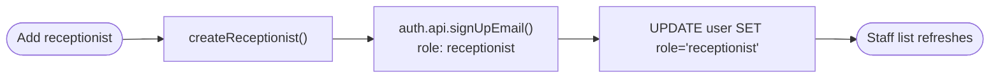

> **DSA used here: none.** Plain CRUD.

The explicit `UPDATE ... SET role` after signup is defensive — it guarantees the role
persisted even if the Better Auth `additionalFields` config didn't apply it.

### 3.3 Admin views WARDS AND BEDS

`/admin/wards` is a **read-only monitor**. Beds are created by `npm run seed`; only
reception changes a bed's state:

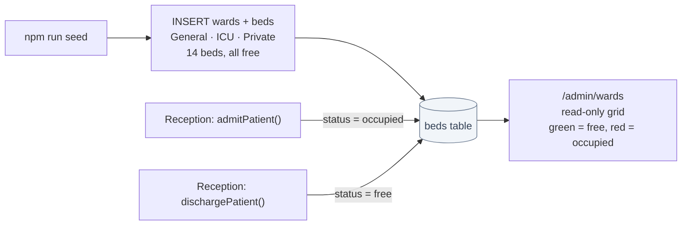

> **DSA used here: none.** The admin panel is straight SQL CRUD throughout — there is
> nothing to order or route, so no structure is involved. This is honest, not a gap.

---

## 4. RECEPTION flows

**Route group:** `src/app/(app)/reception/` · **Guard:** `requireRole("receptionist")`

The busiest role — they own intake, all money, scheduling, beds, and discharge.

### 4.1 Registering a patient — TWO structures run before submit

This is the **most algorithmically interesting flow in the project**.

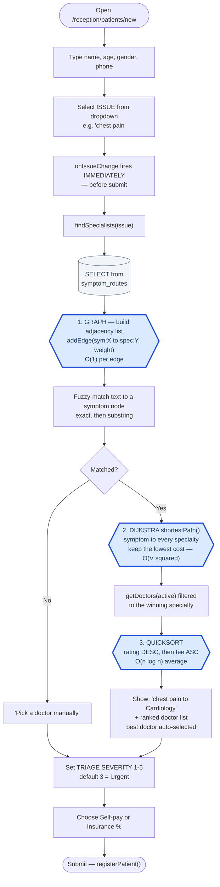

> ### DSA used in this flow — three structures
> | Step | Structure | File | Complexity |
> |---|---|---|---|
> | 1 | **Graph** (adjacency list) | `dsa/graph.ts` | `O(1)` per `addEdge` |
> | 2 | **Dijkstra** shortest path | `dsa/graph.ts` | `O(V²)` linear frontier |
> | 3 | **quickSort** | `dsa/sorting.ts` | `O(n log n)` avg, `O(n²)` worst |
>
> **All three run on dropdown change, not on submit** — so the receptionist watches
> `chest pain → Cardiology` and a rating-ranked doctor list appear *while still
> filling the form*. That is the Graph and the sort doing visible, real work.

Then the write half:

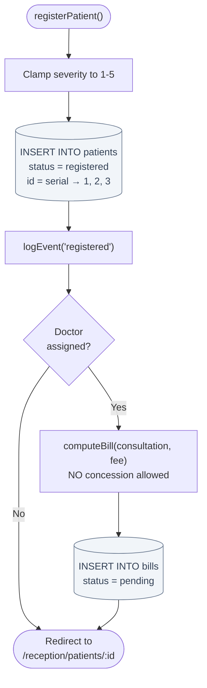

> **DSA used here: none** — this half is pure persistence. **Why severity is set
> here:** reception is the first human to see the patient, so they are the only one
> who can triage. This single integer later lets a critical patient **jump the
> doctor's queue** (§5.1).

#### The routing graph (18 seeded edges → 8 specialties)

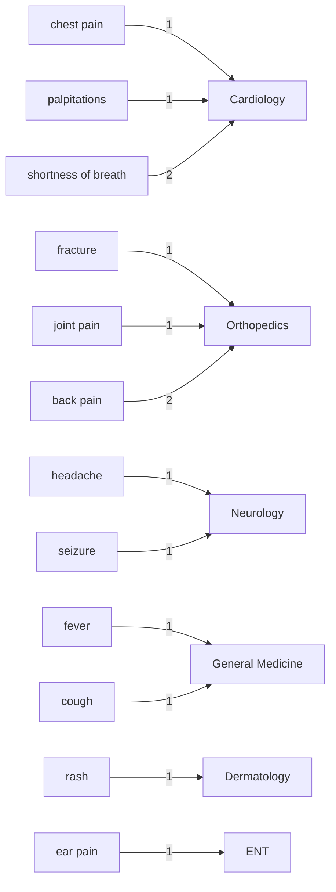

Lower weight = stronger match. `shortness of breath` carries weight 2 to Cardiology
because it is a *weaker* signal than `chest pain` — Dijkstra prefers the cheaper edge
when several could apply.

### 4.2 The reception waiting queue — FIFO

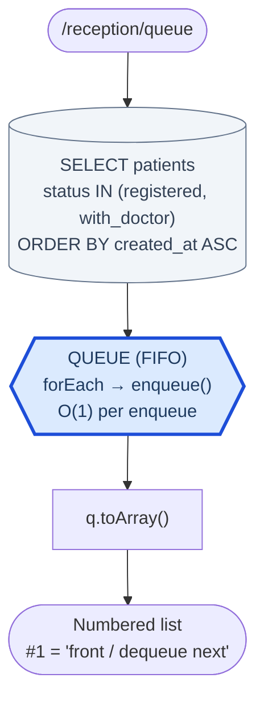

> ### DSA used here: **Queue (FIFO)** — `dsa/queue.ts` · `O(1)` enqueue/dequeue
> Singly-linked chain with `head` + `tail` pointers, so both ends are `O(1)` with no
> array shifting.
>
> **Why FIFO here but not for the doctor?** The waiting *room* is fair — whoever
> walked in first is served first. The doctor's queue is different: a critical patient
> must jump ahead. **Same patients, two orderings, two structures** — this contrast is
> the clearest DSA story in the project.

### 4.3 The reception patient console

Everything reception can do to one patient, at `/reception/patients/[id]`:

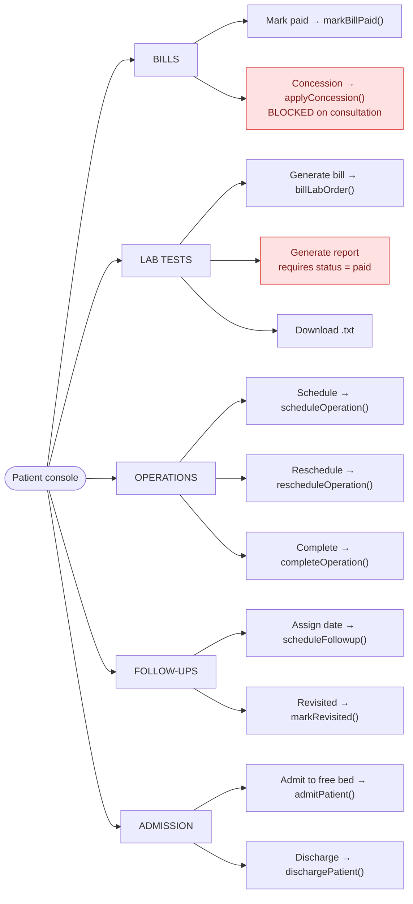

> **DSA used here: DoublyLinkedList** (the timeline panel on this page — see §8).
> The console actions themselves are SQL writes.

---

## 5. DOCTOR flows

**Route group:** `src/app/(app)/doctor/` · **Guard:** `requireRole("doctor")`

Doctors are **read-only on money** — they never touch a bill. That separation is
enforced by which server actions each console imports.

### 5.1 The doctor's queue — MIN PRIORITY QUEUE (emergency triage)

The most important algorithmic feature in the project:

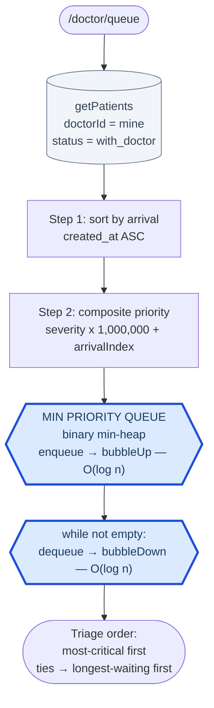

> ### DSA used here: **MinPriorityQueue** — `dsa/priority-queue.ts` · `O(log n)`
> A binary min-heap in an array: parent at `(i-1)/2`, children at `2i+1` / `2i+2`.
> `peek` is `O(1)` because the root is always the minimum.

**The composite-priority trick — why one integer encodes a two-level sort:**

```
priority = severity x 1,000,000 + arrivalIndex
```

Because `arrivalIndex` can never reach 1,000,000, **severity always dominates** and
arrival order can only break a tie. So the heap stays a simple min-heap with no
custom comparator.

| Arrived | Patient | Severity | Priority | Seen |
|:---:|---|:---:|---:|:---:|
| 1st | Ali | 5 Routine | 5,000,000 | **4th** |
| 2nd | Bilal | 1 Critical | 1,000,001 | **1st** |
| 3rd | Chand | 3 Urgent | 3,000,002 | **2nd** |
| 4th | Dawood | 3 Urgent | 3,000,003 | **3rd** |

Bilal arrived 2nd but is seen **1st** — a FIFO queue physically cannot do this. Chand
and Dawood tie on severity, so arrival order breaks it fairly.

### 5.2 Clinical console — notes and orders

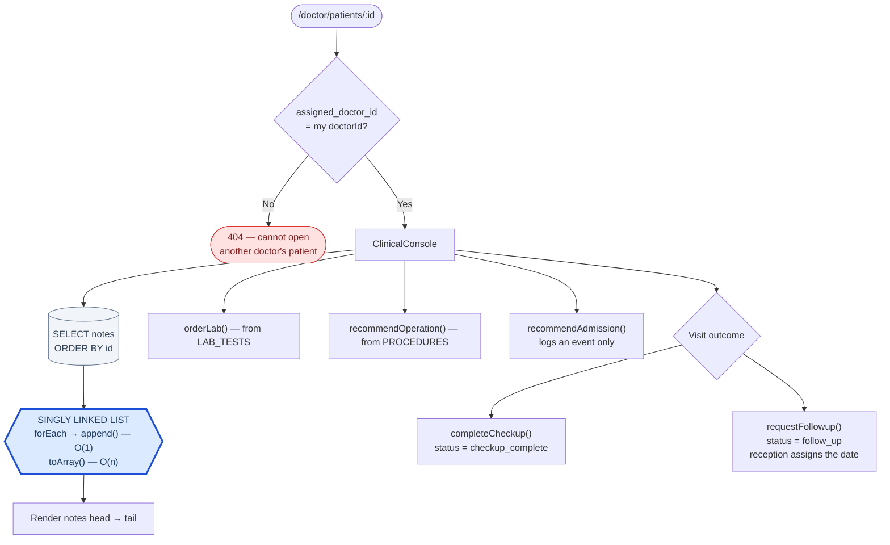

> ### DSA used here: **SinglyLinkedList** — `dsa/linked-list.ts` · `O(1)` append
> Notes are written over time and read back in order — `head → tail`. A `tail` pointer
> makes append `O(1)`; traversal is `O(n)`.

**Row-level authorization:** a doctor opening another doctor's patient gets a 404
(`page.tsx:29`) — the check is on the **row**, not just the route.

**`recommendAdmission` is advisory only** — it writes a timeline event and nothing
else; reception still picks the bed. Same for `recommendOperation`: it creates a row
with status `recommended`, but only reception attaches a date and fee.

---

## 6. THE PATIENT JOURNEY

Split into three readable stages instead of one unreadable chart.

### Stage 1 — Intake and the money gate

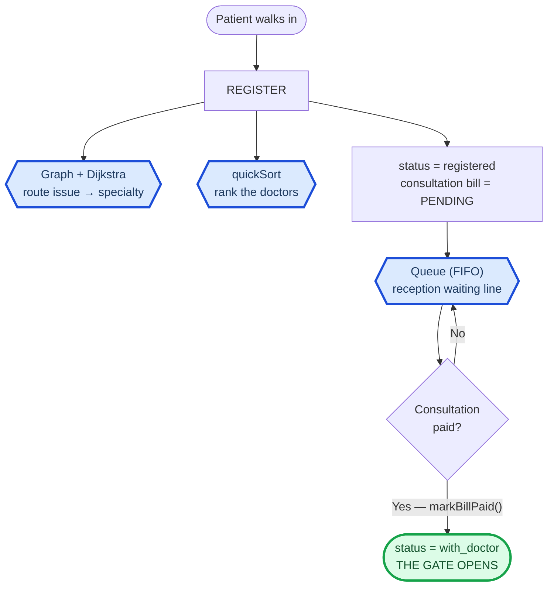

> **DSA in stage 1: Graph + Dijkstra + quickSort** (registration) and **Queue**
> (waiting line).

**The money gate is the spine of the app.** `registered → with_doctor` happens in
exactly one place: inside `markBillPaid()` when `bill.type === 'consultation'`. Until
the patient pays, they cannot appear in any doctor's queue. The guard is
`WHERE id=$1 AND status='registered'`, so paying a second consultation bill can't drag
an admitted patient backwards.

### Stage 2 — The consultation

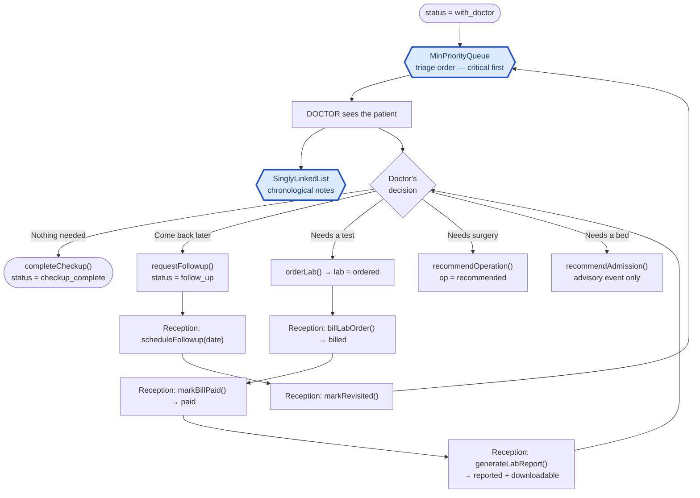

> **DSA in stage 2: MinPriorityQueue** (triage order) and **SinglyLinkedList** (notes).

### Stage 3 — Operation, admission, discharge

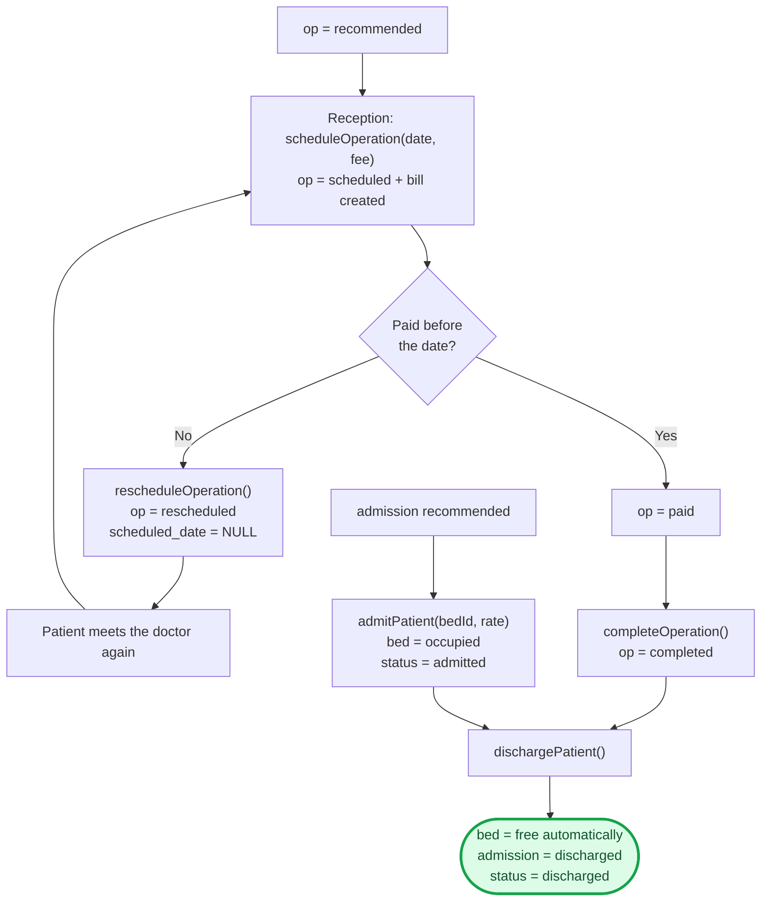

> **DSA in stage 3: none.** Scheduling, admission, and discharge are state machines
> over SQL. The **operation loop** is the only cycle in the system: unpaid by the
> scheduled date → reschedule → see the doctor again → new date.

### The state machine

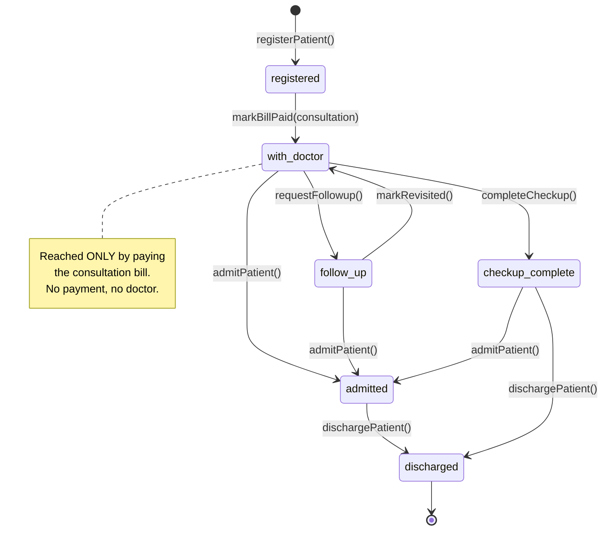

---

## 7. Billing — the money rules

**File:** `lib/billing.ts` — all bill maths in one pure function, `computeBill()`.

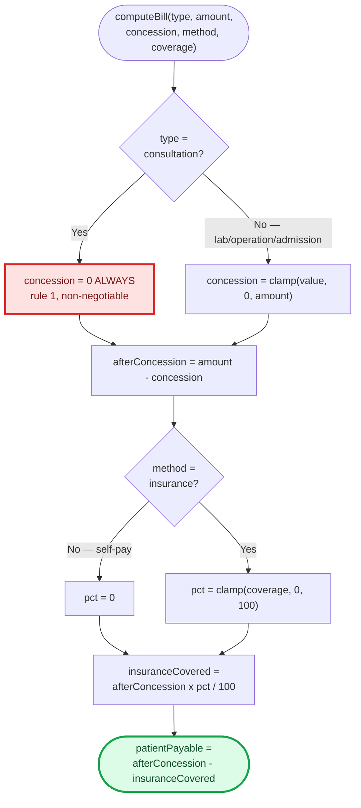

> **DSA used here: none.** Pure arithmetic — deliberately isolated in one testable
> function. (`DynamicArray` models bill line-items in the `/dsa` gallery, but the real
> billing page uses plain SQL.)

**Order of operations: concession FIRST, then insurance.** This matters — it is
strictly better for the *insurer* than the reverse, so it must be deliberate:

> Bill Rs 10,000 · concession Rs 2,000 · insurance 80%
> - **This system:** (10,000 − 2,000) × 20% = **Rs 1,600 payable**
> - If reversed: (10,000 × 20%) − 2,000 = Rs 0 payable

**The consultation rule is enforced three times** — defence in depth: `computeBill()`
forces `concession = 0`; `applyConcession()` **throws**; and the UI doesn't even render
the button.

### What paying each bill type unlocks

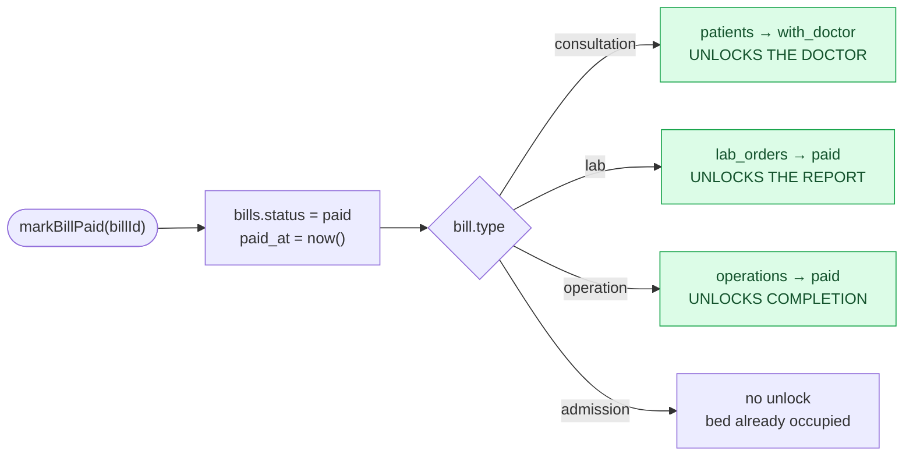

Every payment is a **state unlock**. This one function is the hinge of the workflow.

---

## 8. The audit trail and the timeline

**Every** meaningful action calls `logEvent()`, appending one immutable row to
`patient_events`. Nothing ever updates or deletes them.

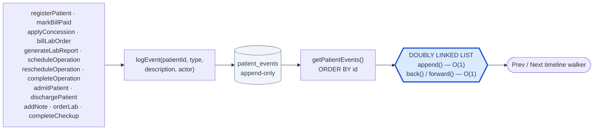

> ### DSA used here: **DoublyLinkedList** — `dsa/doubly-linked-list.ts` · `O(1)` both ways
> Each node holds `prev` **and** `next`, plus a `cursor` for the current event — so
> stepping backward or forward is `O(1)`. The events are inherently a **chain**, which
> is exactly what this structure is for.
>
> ⚠️ **See §10.1** — the list is currently built but not actually read.

The `actor` string comes from `actor()` → `"Name (role)"`, so the timeline records
**who** did each thing, not just what happened.

---

## 9. DSA MAP — the summary

### 9.1 Structures wired into live workflows (7)

| # | Structure | File | Runs in | Triggered by | Complexity |
|:---:|---|---|---|---|---|
| 1 | **Graph + Dijkstra** | `dsa/graph.ts` | `lib/routing.ts` | Reception picks an issue | `O(V²)` |
| 2 | **quickSort** | `dsa/sorting.ts` | `lib/routing.ts` | Same request — ranks doctors | `O(n log n)` avg |
| 3 | **Queue (FIFO)** | `dsa/queue.ts` | `reception/queue` | Page load | `O(1)` |
| 4 | **MinPriorityQueue** | `dsa/priority-queue.ts` | `doctor/queue` | Page load | `O(log n)` |
| 5 | **SinglyLinkedList** | `dsa/linked-list.ts` | `clinical-console` | Doctor opens a patient | `O(1)` append |
| 6 | **DoublyLinkedList** | `dsa/doubly-linked-list.ts` | `timeline-viewer` | Any patient detail page | `O(1)` both ways |
| 7 | **Sorting (5 algorithms)** | `dsa/sorting.ts` | `/dsa` sort-race | Gallery demo | see `DSA.md` |

### 9.2 Implemented and demonstrated in the gallery (4)

Fully implemented and unit-tested, shown on `/dsa` with live complexity tables, but no
production page feeds real rows through them:

| Structure | File | Models |
|---|---|---|
| **Stack (LIFO)** | `dsa/stack.ts` | Undo / action history |
| **BST** | `dsa/bst.ts` | Patient lookup by ID |
| **Red-Black Tree** | `dsa/red-black-tree.ts` | Appointment index by date — height 17 for 1,000 sorted inserts |
| **HashMap** | `dsa/hash-map.ts` | O(1) lookups — djb2 + separate chaining |
| **DynamicArray** | `dsa/dynamic-array.ts` | Bill line-items + binary search |

> Be precise in a viva: **7 structures do real work; 4 are demonstrated.** `DSA.md`'s
> own table already marks the second group as *"Implemented + gallery"* rather than
> *"Yes — wired"*, so this document agrees with it.

### 9.3 Which DSA runs on which route

```mermaid
flowchart LR
    subgraph REC["RECEPTION"]
        R1["/patients/new"]
        R2["/queue"]
        R3["/patients/:id"]
    end
    subgraph DOC["DOCTOR"]
        D1["/queue"]
        D2["/patients/:id"]
    end
    subgraph ADM["ADMIN"]
        A1["/doctors · /staff · /wards"]
    end

    R1 --> G{{"Graph + Dijkstra"}}
    R1 --> QS{{"quickSort"}}
    R2 --> Q{{"Queue FIFO"}}
    R3 --> DLL{{"DoublyLinkedList"}}
    D1 --> PQ{{"MinPriorityQueue"}}
    D2 --> SLL{{"SinglyLinkedList"}}
    D2 --> DLL
    A1 --> NONE["no DSA — plain SQL"]

    classDef dsa fill:#dbeafe,stroke:#1d4ed8,stroke-width:3px,color:#1e3a5f
    class G,QS,Q,DLL,PQ,SLL dsa
```

---

## 10. Known gaps

| # | Issue | Where | Impact |
|:---:|---|---|---|
| 1 | **DoublyLinkedList built but never read** | `timeline-viewer.tsx:13-24` | Docs claim `O(1)` cursor walking; the structure is decorative today |
| 2 | **No bed/ward CRUD** | seed only | Admin can't add a ward/bed without re-seeding |
| 3 | **`PatientStatus` type out of date** — missing `follow_up`, `checkup_complete` | `lib/types.ts:3-7` | Type lists 4 statuses; the schema has 6 |
| 4 | **Search interpolates a raw string into SQL** | `lib/data.ts:69` | Strips quotes instead of parameterising, unlike every other query |
| 5 | **`recommendAdmission` changes no state** | `actions.ts:392` | Logs an event only |
| 6 | **Operation deadline not enforced** | `actions.ts` | "Pay before the date" is a manual check |

### 10.1 The one place code and docs disagree

`src/components/timeline-viewer.tsx` builds the DoublyLinkedList and then never reads
it:

```js
const list = useMemo(() => {          // built...
  const dll = new DoublyLinkedList();
  events.forEach((e) => dll.append(e));
  return dll;
}, [events]);

const current = events[clamped];       // ...but rendering uses ARRAY INDEXING
```

Prev/Next call `setIdx(i ± 1)` and read `events[clamped]` — the array — instead of the
list's `back()` / `forward()` cursor. The timeline renders correctly, but the DLL is
**decorative**, contradicting `DSA.md §5` and the "O(1) forward/back" caption.

**Fix:** drive the cursor from the list. Small change, and a viva question like *"show
me the doubly linked list actually running"* would land right here.

---

## 11. Programming module map

| Module / Feature | Where | Why |
|---|---|---|
| **Next.js App Router** | `src/app/**` | File-system routing; `(app)` groups a shared layout without a URL segment |
| **React Server Components** | every `page.tsx` | Query Postgres directly — no API layer |
| **Client Components** | forms, consoles | Needed for `useState` and event handlers |
| **Server Actions** | `lib/actions.ts` | **Every write** — type-safe RPC, no REST endpoints |
| **`proxy.ts`** | root | Next.js 16's renamed `middleware.ts` |
| **`revalidatePath()`** | after every write | Busts the Server Component cache |
| **`useTransition()`** | every console | Non-blocking pending state — drives `disabled={pending}` |
| **React `cache()`** | `session.ts` | One session lookup per request, not two |
| **Dynamic routes** | `patients/[id]` | `params` is a **Promise** in Next.js 16 — must be awaited |
| **`Promise.all()`** | detail pages | 6-8 queries in parallel, not sequentially |
| **Better Auth** | `lib/auth.ts` | Email/password + role & doctorId via `additionalFields` |
| **`pg` Pool** | `lib/db.ts` | Cached on `globalThis` so hot-reload doesn't exhaust connections |
| **Parameterised SQL** | everywhere | Injection safety |
| **Postgres `serial`** | `patients.id` | Auto integer IDs, collision-safe |
| **Postgres `CHECK`** | `schema.sql` | DB refuses invalid status/severity even if app code has a bug |
| **`ON DELETE CASCADE`** | FKs | Deleting a patient cleans up bills/notes/events |
| **`Blob` + `createObjectURL`** | `patient-console` | Client-side report download, no round-trip |

### Request lifecycle — a write, end to end

```mermaid
sequenceDiagram
    participant U as User
    participant C as Client Component
    participant A as Server Action
    participant D as DSA Layer
    participant DB as Postgres

    U->>C: Click "Mark paid"
    C->>C: startTransition() — pending = true
    C->>A: markBillPaid(billId)
    A->>DB: UPDATE bills SET status='paid'
    DB-->>A: patient_id, type
    A->>DB: UPDATE patients SET status='with_doctor'
    A->>DB: INSERT INTO patient_events
    A->>A: revalidatePath()
    A-->>C: done
    C->>C: router.refresh()
    C->>DB: SELECT rows
    DB-->>D: raw rows
    D->>D: build structure, run algorithm
    D-->>C: ordered result
    C-->>U: Fresh page
```

---

## 12. Quick reference

### Role capabilities

| Capability | Admin | Reception | Doctor |
|---|:---:|:---:|:---:|
| Create doctor / receptionist | ✅ | ❌ | ❌ |
| View wards and beds | ✅ read-only | ✅ admit | ❌ |
| Register patient | ❌ | ✅ | ❌ |
| Set triage severity | ❌ | ✅ | ❌ |
| Bills / concessions / payments | ❌ | ✅ | ❌ |
| Notes, labs, operations | ❌ | ❌ | ✅ |
| Close visit / request follow-up | ❌ | ❌ | ✅ |
| Schedule ops and follow-up dates | ❌ | ✅ | ❌ |
| Admit / discharge | ❌ | ✅ | ❌ |
| DSA Gallery | ✅ | ✅ | ✅ |

### File responsibilities

```
src/
├── proxy.ts                    Cookie gate (Next.js 16 middleware)
├── app/
│   ├── page.tsx                Redirect to role home
│   ├── login/                  Better Auth sign-in
│   └── (app)/
│       ├── layout.tsx          requireUser() + role-based nav
│       ├── admin/              Doctors CRUD, staff, wards (read-only)   [no DSA]
│       ├── reception/          Intake, billing, FIFO queue, console     [Graph, quickSort, Queue, DLL]
│       ├── doctor/             Priority queue, clinical console         [MinPQ, SLL, DLL]
│       └── dsa/                Gallery + live demos                     [all 11]
├── components/
│   └── timeline-viewer.tsx     DoublyLinkedList timeline   (see §10.1)
└── lib/
    ├── actions.ts              ALL writes (server actions)
    ├── data.ts                 All reads
    ├── routing.ts              Graph + Dijkstra + quickSort
    ├── billing.ts              computeBill() — all money maths
    ├── auth.ts / session.ts    Better Auth + requireRole()
    ├── catalog.ts              LAB_TESTS, PROCEDURES, report generator
    └── dsa/                    11 hand-written structures
```

### Demo script (5 minutes, hits every live structure)

1. **Admin** → `/admin/doctors` → add a Cardiology doctor, rating 4.9
2. **Reception** → New Patient → issue **"chest pain"** →
   *watch the **Graph** route to Cardiology and **quickSort** rank your new doctor first*
3. Severity **1 (Critical)** → register → **Mark consultation paid**
4. Register a second patient, severity **5 (Routine)** → pay
5. **Doctor** → `/doctor/queue` →
   *the critical patient is #1 despite registering second — the **min-heap** at work*
6. Open the patient → add two notes (**SinglyLinkedList**) → order a lab test
7. **Reception** → bill the lab → pay → generate report → download
8. Admit to a bed → `/admin/wards` shows it occupied → discharge → free again
9. Walk the **timeline** Prev/Next (**DoublyLinkedList**)
10. **`/dsa`** → run the sort race and the triage demo

---

*Generated by reading every file in `src/`, `scripts/`, and `schema.sql`.*
