# MediStruct — Complete Project Flow

This document traces **every use case** in the system end-to-end: who does what,
which file handles it, which **data structure** runs, and which **programming
module** (framework feature) carries it.

It is written to be read top-to-bottom: architecture → login → admin → reception
→ doctor → the full patient journey → the DSA/module maps.

> Companion docs: [`README.md`](README.md) (setup), [`DSA.md`](DSA.md) (pseudocode
> + complexity of each structure). This file covers **flow** — how the pieces
> connect.

---

## 1. The three-layer architecture

Every feature in this app follows the same shape. Understanding this one diagram
makes the rest of the document predictable:

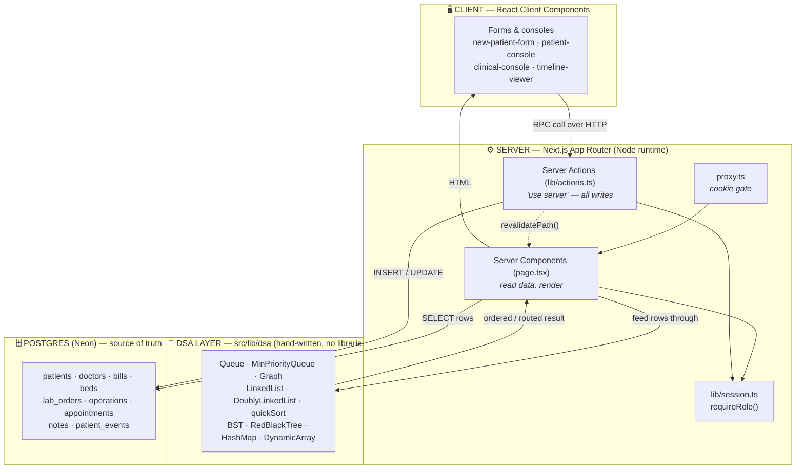

**The key idea:** Postgres stores, the DSA layer *works*. A request is almost
always:

> **read rows from Postgres → build a data structure → run its algorithm → render**

The database never does the sorting/routing/prioritising — our own code does.
That is what makes this a DSA project rather than a CRUD app.

---

## 2. Login & role routing (all users)

**Files:** `src/app/login/`, `src/lib/auth.ts`, `src/lib/session.ts`, `src/proxy.ts`

There is **no public sign-up**. The admin creates every account. Patients are
*records*, not users — they never log in.

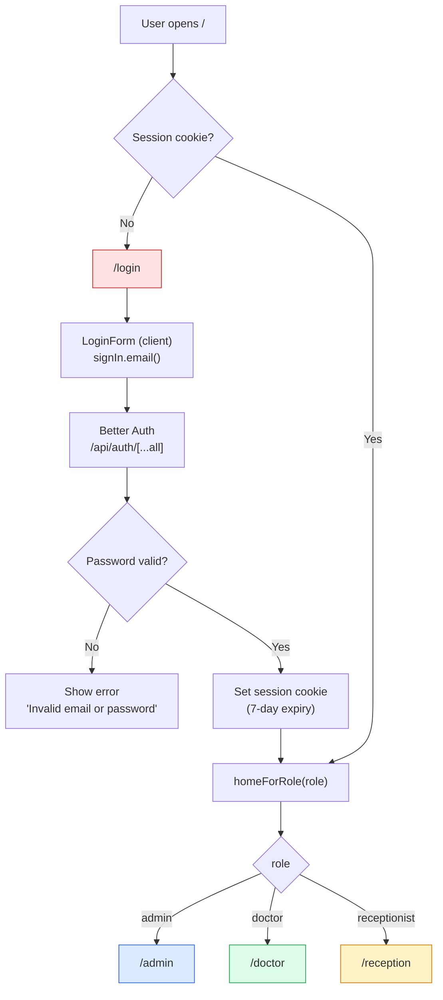

### Two-gate security model

Authorization is checked **twice**, deliberately:

| Gate | File | What it does | Why it isn't enough alone |
|---|---|---|---|
| **1. Optimistic** | `proxy.ts` | Checks a session cookie *exists*; bounces to `/login` if not | Only checks presence, never verifies the cookie or the role |
| **2. Authoritative** | `requireRole()` in every layout/page | Reads the **verified** session, redirects if the role is wrong | This is the real check |

`proxy.ts` is Next.js 16's rename of `middleware.ts`. `getCurrentUser()` is
wrapped in React `cache()` so the layout and page share **one** session lookup
per request instead of two DB hits.

---

## 3. ADMIN use cases

**Route group:** `src/app/(app)/admin/` · **Guard:** `requireRole("admin")`

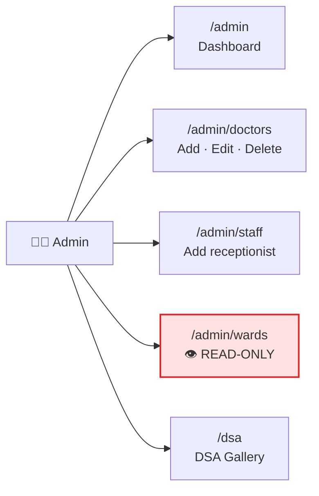

### 3.1 Admin adds a DOCTOR

This is the one flow that writes to **two systems at once** — the domain table
and the auth table — and then links them together.

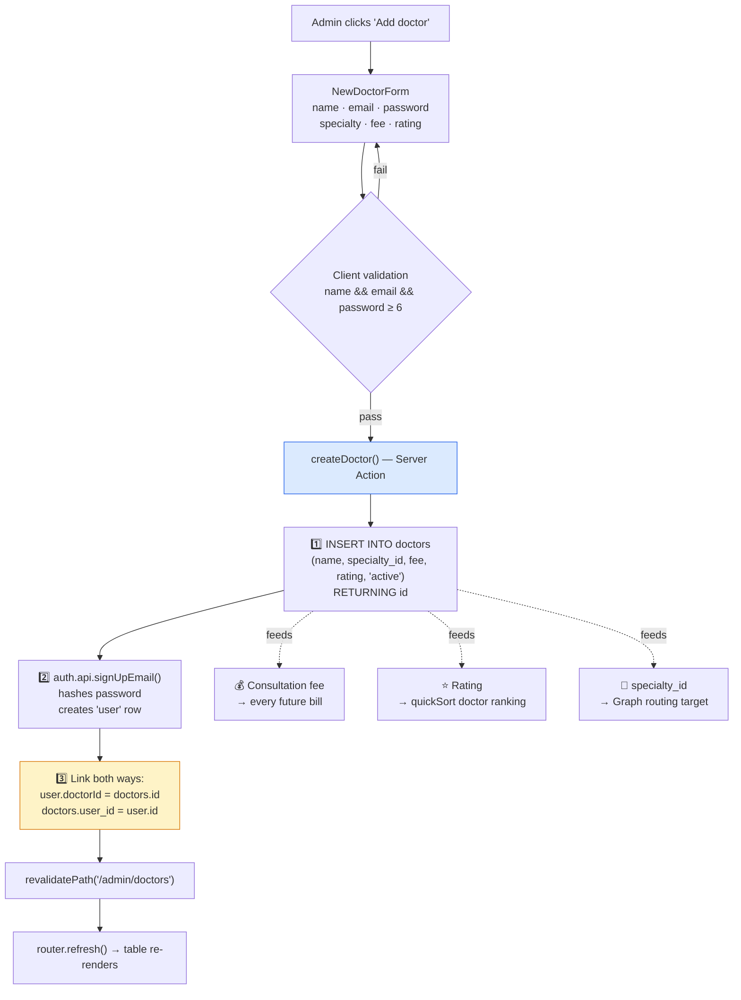

**Why the two-way link matters:** when Dr. Sara logs in, `session.doctorId` tells
the app *which doctor row she is*, so `/doctor/queue` can filter to her patients
only. Without it she would see everyone's queue.

The three fields the admin types here are not cosmetic — they are the **inputs to
two different algorithms**:
- `rating` + `consultation_fee` → the **quickSort comparator** that ranks doctors
- `specialty_id` → the **Graph node** that symptom routing targets

**Delete** (`deleteDoctor`) removes the doctor row *and* their login row, so a
deleted doctor cannot sign in.

### 3.2 Admin adds a RECEPTIONIST

Simpler — a receptionist has no domain row, only a login:

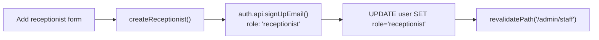

The explicit `UPDATE ... SET role` after signup is a **defensive belt-and-braces**
step: it guarantees the role persisted even if the Better Auth `additionalFields`
config didn't apply it.

### 3.3 Admin and BEDS — ⚠️ important correction

**The admin cannot add beds through the UI.** This is worth stating plainly
because it's the one place where the running system differs from what you might
expect from the nav menu.

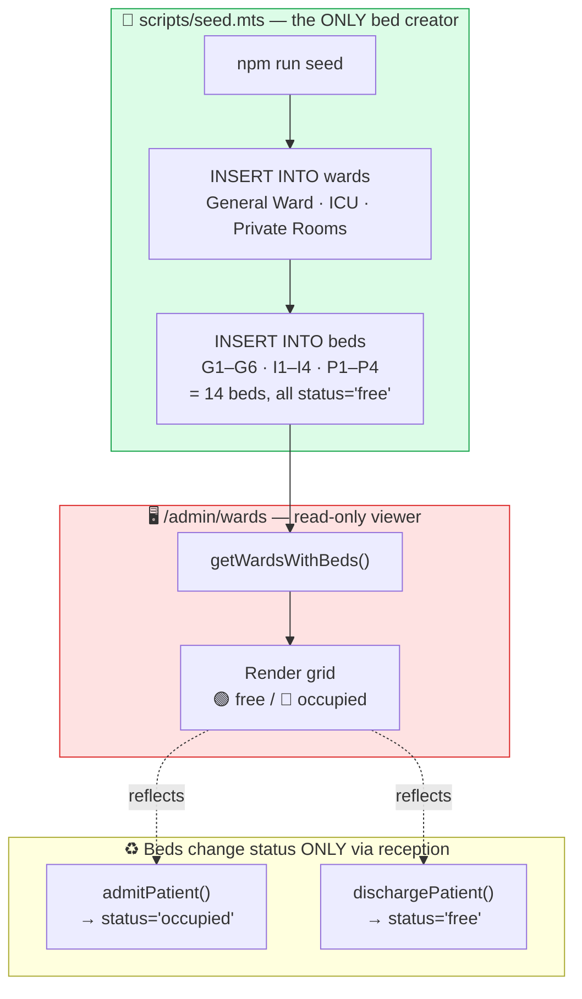

**Evidence:** `INSERT INTO beds` / `INSERT INTO wards` appear **only** in
`scripts/seed.mts:90` and `scripts/seed.mts:95`. There is no `createBed` or
`createWard` server action anywhere in `src/lib/actions.ts`, and
`src/app/(app)/admin/wards/page.tsx` renders a grid with **no buttons or forms**.

So the accurate statement is: **the admin *provisions* bed capacity by seeding,
and *monitors* it at `/admin/wards`. The receptionist is the only role that
changes a bed's state** (by admitting/discharging). If bed CRUD is a requirement,
it is a genuine gap — see §10.

---

## 4. RECEPTIONIST use cases

**Route group:** `src/app/(app)/reception/` · **Guard:** `requireRole("receptionist")`

The receptionist is the **busiest role** — they own intake, all money, scheduling,
beds, and discharge.

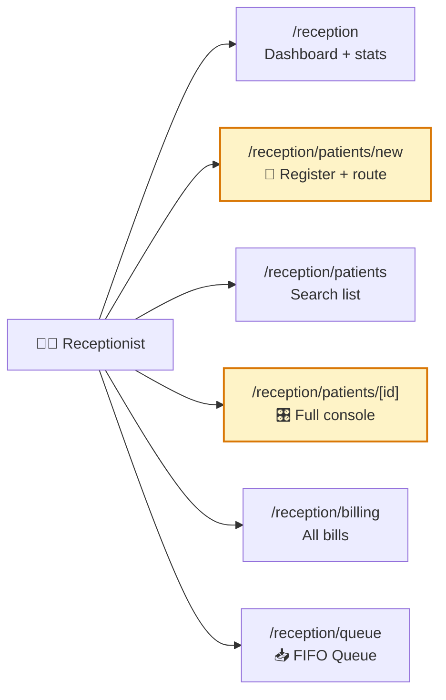

### 4.1 Registering a patient — the flagship flow

This is the **most algorithmically interesting flow in the project**. It runs a
**Graph + Dijkstra** *and* a **quickSort** before the patient row even exists.

```mermaid
flowchart TD
    A["Receptionist opens /reception/patients/new"] --> B["Type name, age, gender, phone, address"]
    B --> C["Select ISSUE from dropdown<br/>e.g. 'chest pain'"]

    C --> D["🔴 onIssueChange fires immediately<br/>(before submit!)"]
    D --> E["findSpecialists(issue)<br/>Server Action"]

    subgraph ROUTE["🧮 routeIssue() — lib/routing.ts"]
        E --> F["getSymptomRoutes()<br/>SELECT from symptom_routes"]
        F --> G["Build Graph (directed)<br/>addEdge(sym:X → spec:Y, weight)"]
        G --> H["Fuzzy-match free text → symptom node<br/>exact → substring → null"]
        H --> I{"Matched?"}
        I -->|No| J["Return empty<br/>'Pick a doctor manually'"]
        I -->|Yes| K["🎯 Dijkstra shortestPath()<br/>to EVERY specialty<br/>keep lowest cost"]
        K --> L["getDoctors(activeOnly=true)<br/>filter to that specialty"]
        L --> M["🎯 quickSort(doctors)<br/>rating DESC, then fee ASC"]
    end

    M --> N["UI shows:<br/>'chest pain → Cardiology'<br/>+ ranked doctor list"]
    N --> O["Best doctor auto-selected<br/>setDoctorId(r.doctors[0].id)"]

    O --> P["Set TRIAGE SEVERITY 1–5<br/>(default 3 = Urgent)"]
    P --> Q["Choose Self-pay or Insurance %"]
    Q --> R["Submit → registerPatient()"]

    subgraph REG["⚙️ registerPatient() — lib/actions.ts"]
        R --> S["Clamp severity to 1–5<br/>Math.min(5, Math.max(1, ...))"]
        S --> T["INSERT INTO patients<br/>status='registered'<br/>id = serial → 1, 2, 3…"]
        T --> U["logEvent('registered')"]
        U --> V{"Doctor assigned?"}
        V -->|Yes| W["computeBill(consultation, fee)<br/>⚠️ NO concession allowed"]
        W --> X["INSERT INTO bills<br/>status='pending'"]
        X --> Y["logEvent('consultation_billed')"]
        V -->|No| Z["skip billing"]
    end

    Y --> AA["redirect → /reception/patients/[id]"]
    Z --> AA

    style ROUTE fill:#eff6ff,stroke:#2563eb
    style REG fill:#fefce8,stroke:#d97706
    style K fill:#dbeafe,stroke:#2563eb,stroke-width:2px
    style M fill:#dbeafe,stroke:#2563eb,stroke-width:2px
```

**Two DSA structures run before submit.** The routing happens on *dropdown change*,
not on submit — so the receptionist sees `chest pain → Cardiology` and a
rating-ranked doctor list *while still filling the form*. That is the Graph and
the quickSort doing visible, real work.

**Why severity is set here:** the receptionist is the first human to see the
patient, so they are the only one who can triage. This single integer is what
later lets a critical patient **jump the doctor's queue** (§5.1).

#### The routing graph (seeded, 18 edges → 8 specialties)

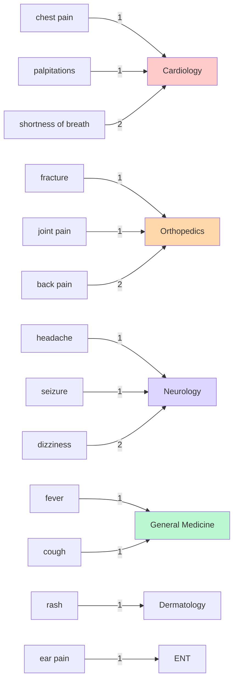

Lower weight = stronger match. `shortness of breath` has weight 2 to Cardiology
because it's a *weaker* signal than `chest pain` — Dijkstra prefers the cheaper
edge when several could apply.

### 4.2 The reception waiting queue — FIFO

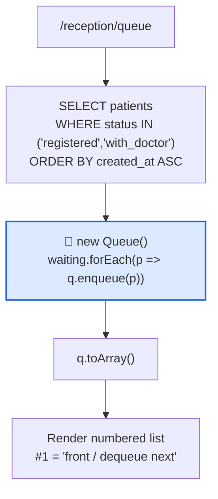

**Why FIFO here but not for the doctor?** The waiting *room* is fair — whoever
walked in first is served first. The **doctor's** queue is different: a critical
patient must jump ahead. Same patients, two different orderings, two different
structures. This contrast is the clearest DSA story in the project.

### 4.3 The reception patient console — the control panel

Everything the receptionist can do to one patient lives at
`/reception/patients/[id]`:

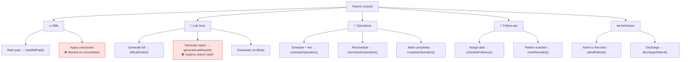

---

## 5. DOCTOR use cases

**Route group:** `src/app/(app)/doctor/` · **Guard:** `requireRole("doctor")`

Doctors are **read-only on money** — they never touch a bill. They only do
clinical work. That separation is enforced by which server actions each console
imports.

### 5.1 The doctor's queue — Min Priority Queue (emergency triage)

This is the **most important algorithmic feature for grading**, because it shows
*why* a heap beats a plain queue.

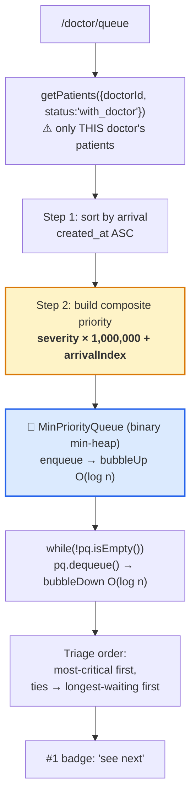

**The composite-priority trick — why it works:**

```
priority = severity × 1,000,000 + arrivalIndex
```

Because `arrivalIndex` can never reach 1,000,000, **severity always dominates**
and arrival order can only ever break a tie. One integer encodes a two-level sort,
so the heap stays a simple min-heap with no custom comparator.

Worked example — arrival order vs. triage order:

| Arrived | Patient | Severity | Priority | 👉 Seen |
|:---:|---|:---:|---:|:---:|
| 1st | Ali | 5 (Routine) | 5,000,000 | **4th** |
| 2nd | Bilal | 1 (Critical) | 1,000,001 | **1st** |
| 3rd | Chand | 3 (Urgent) | 3,000,002 | **2nd** |
| 4th | Dawood | 3 (Urgent) | 3,000,003 | **3rd** |

Bilal arrived 2nd but is seen **1st** — a plain FIFO queue physically cannot do
this. Chand and Dawood tie on severity 3, so arrival order breaks the tie fairly.

### 5.2 Clinical console — notes & orders

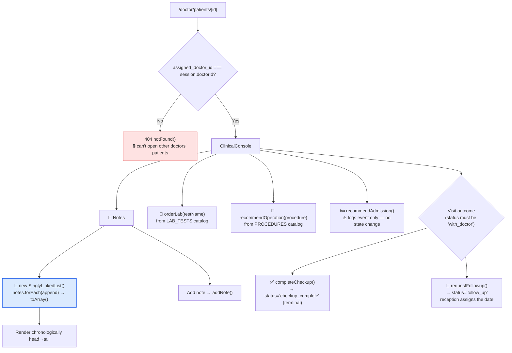

**Note the ownership check** (`page.tsx:29`): a doctor opening another doctor's
patient gets a 404. Authorization is at the **row level**, not just the route.

**`recommendAdmission` is advisory only** — it writes a timeline event and nothing
else. The receptionist still has to actually pick a bed. Same for
`recommendOperation`: it creates an operation row with status `'recommended'`, but
only reception can attach a date and a fee.

---

## 6. THE FULL PATIENT JOURNEY — every state transition

This is the master flowchart. It shows the whole lifecycle and, crucially, the
**handoffs between roles**.

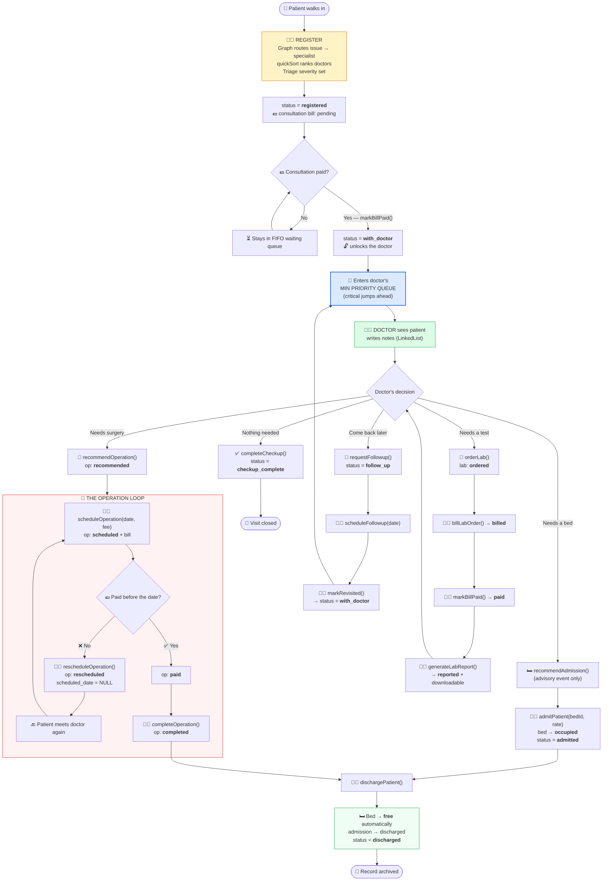

### The patient state machine (strict)

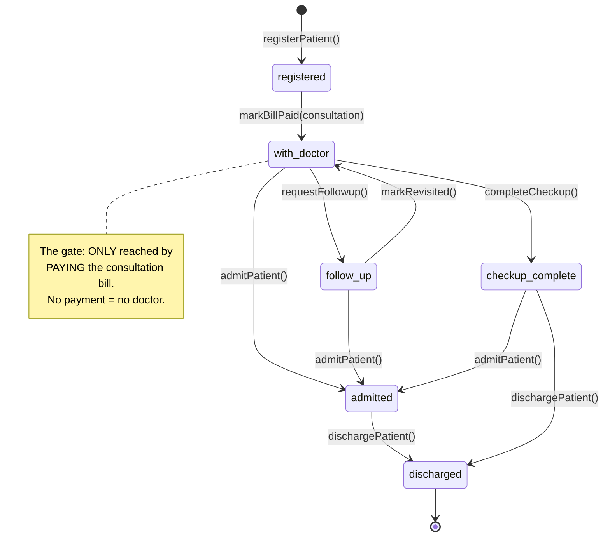

**The money gate is the spine of the whole app.** `registered → with_doctor`
happens *only* inside `markBillPaid()` when `bill.type === 'consultation'`. Until
the patient pays, they cannot appear in any doctor's priority queue. Notice the
guard is `WHERE id=$1 AND status='registered'` — so paying a *second* consultation
bill can't drag an already-admitted patient backwards.

---

## 7. Billing — the money rules

**File:** `src/lib/billing.ts` — all bill maths lives in one pure function,
`computeBill()`.

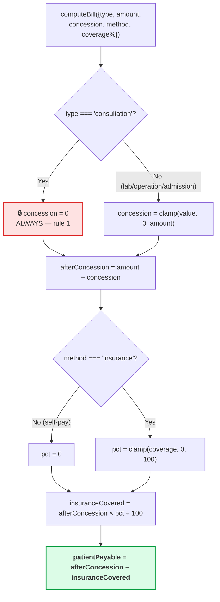

**Order of operations: concession FIRST, then insurance.** This matters — it is
strictly better for the *insurer* and worse for the patient than the reverse
order, so it must be deliberate:

> Bill Rs 10,000 · concession Rs 2,000 · insurance 80%
> - **This system:** (10,000 − 2,000) × 20% = **Rs 1,600 payable**
> - If reversed: (10,000 × 20%) − 2,000 = Rs 0 payable
>
> The concession is shared with the insurer rather than given entirely to the
> patient.

**The consultation rule is enforced twice** — defence in depth:
1. In `computeBill()` — `type === 'consultation'` forces `concession = 0`
2. In `applyConcession()` — **throws** `"Concession is not allowed on the consultation fee."`
3. And a third time in the UI — the Concession button doesn't even render
   (`canConcession = bill.type !== "consultation"`)

### What paying each bill type unlocks

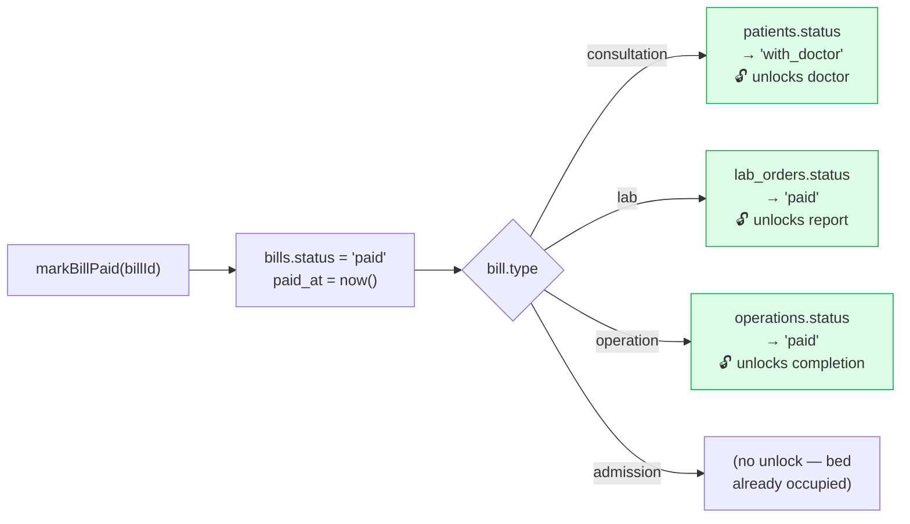

Every payment is a **state unlock**. This one function is the hinge of the entire
workflow.

---

## 8. The audit trail — how the timeline is built

**Every** meaningful action calls `logEvent()`, which appends one immutable row to
`patient_events`. Nothing ever updates or deletes them.

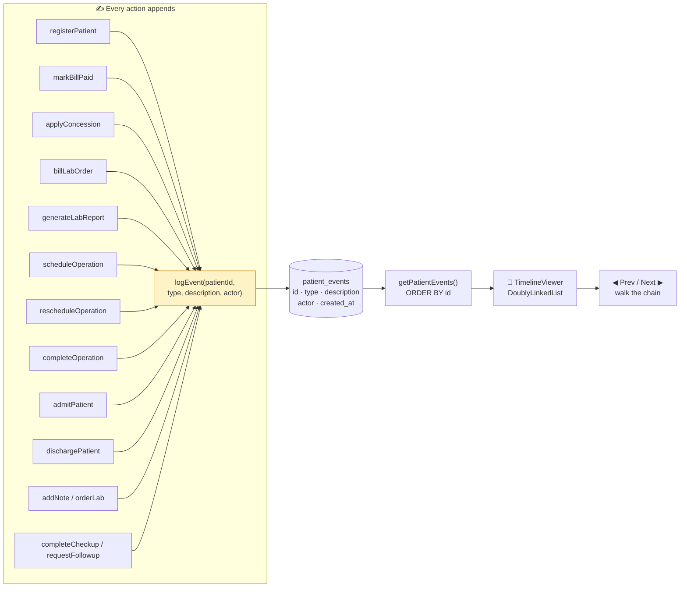

The `actor` string comes from `actor()` → `"Name (role)"`, so the timeline records
**who** did each thing, not just what happened. This append-only log is what makes
the doubly linked list the natural fit: the events are inherently a **chain**, and
the UI walks it in both directions.

---

## 9. DSA MAP — where every structure runs

### 9.1 Structures wired into live workflows (7)

| # | Structure | File | Runs in | Triggered by | Complexity |
|:---:|---|---|---|---|---|
| 1 | **Graph + Dijkstra** | `dsa/graph.ts` | `lib/routing.ts` | Reception picks an issue | `O(V²)` |
| 2 | **quickSort** | `dsa/sorting.ts` | `lib/routing.ts` | Same request — ranks doctors | `O(n log n)` avg |
| 3 | **Queue (FIFO)** | `dsa/queue.ts` | `reception/queue` | Page load | `O(1)` enq/deq |
| 4 | **MinPriorityQueue** | `dsa/priority-queue.ts` | `doctor/queue` | Page load | `O(log n)` |
| 5 | **SinglyLinkedList** | `dsa/linked-list.ts` | `clinical-console` | Doctor opens a patient | `O(1)` append |
| 6 | **DoublyLinkedList** | `dsa/doubly-linked-list.ts` | `timeline-viewer` | Any patient detail page | `O(1)` back/forward |
| 7 | **Sorting (5 algos)** | `dsa/sorting.ts` | `/dsa` sort-race | Gallery demo | see `DSA.md` |

### 9.2 Structures implemented + demonstrated in the gallery (4)

These are fully implemented and unit-tested, and appear on `/dsa` with live
complexity tables, but no production page feeds real rows through them:

| Structure | File | Models |
|---|---|---|
| **Stack (LIFO)** | `dsa/stack.ts` | Undo / action history |
| **BST** | `dsa/bst.ts` | Patient lookup by ID |
| **Red-Black Tree** | `dsa/red-black-tree.ts` | Appointment index by date (stays `O(log n)` on sorted inserts — height 17 for 1,000) |
| **HashMap** | `dsa/hash-map.ts` | O(1) patient / doctor lookup (djb2 + chaining) |
| **DynamicArray** | `dsa/dynamic-array.ts` | Bill line-items + binary search |

Be precise about this distinction if you're asked in a viva: **7 structures do
real work; 4 are demonstrated.** `DSA.md`'s own table already marks the second
group as *"Implemented + gallery"* rather than *"Yes — wired"*, so this document
agrees with it.

### 9.3 The one place the code and the docs disagree

⚠️ **`src/components/timeline-viewer.tsx` builds the DoublyLinkedList but never
reads it.**

```js
const list = useMemo(() => {         // ← built…
  const dll = new DoublyLinkedList<PatientEvent>();
  events.forEach((e) => dll.append(e));
  return dll;
}, [events]);

const [idx, setIdx] = useState(events.length - 1);
const current = events[clamped];      // ← …but rendering uses ARRAY INDEXING
```

`list` is assigned and never used again. Prev/Next call `setIdx(i ± 1)` and read
`events[clamped]` — the array — instead of the list's `back()` / `forward()`
cursor. So the rendered timeline is correct, but the DLL is currently
**decorative**, which contradicts the claim in `DSA.md §5` and the
"walk forward/back in O(1)" caption on both patient detail pages.

**Fix:** drive the cursor from the list — call `list.back()` / `list.forward()`
in the buttons and render the returned value. That is a small change and it would
make the caption true. Worth doing before submission, since a viva question like
*"show me the doubly linked list actually running"* would land right here.

### 9.4 Which DSA runs on which route

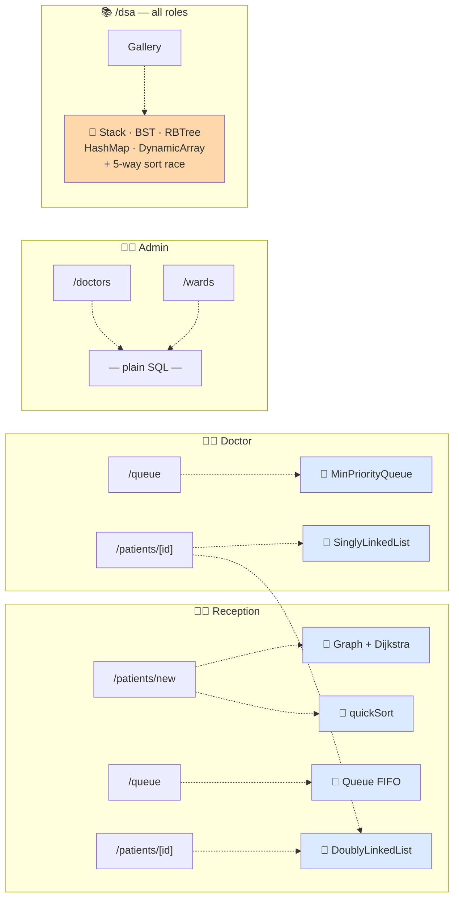

Note the admin panel uses **no data structure** — it's straight CRUD over SQL.
That's honest and correct: there's nothing to order or route there.

---

## 10. PROGRAMMING MODULE MAP

Which framework/language feature carries which responsibility:

| Module / Feature | Where | Why it was chosen |
|---|---|---|
| **Next.js App Router** | `src/app/**` | File-system routing; `(app)` groups shared layout without a URL segment |
| **React Server Components** | every `page.tsx` | Query Postgres directly in the component — no API layer needed |
| **Client Components** (`"use client"`) | forms, consoles, timeline | Needed for `useState` / event handlers |
| **Server Actions** (`"use server"`) | `lib/actions.ts` | **Every write.** Type-safe RPC from client → server with no REST endpoints |
| **`proxy.ts`** | root | Next.js 16's renamed `middleware.ts` — optimistic cookie gate |
| **`revalidatePath()`** | after every write | Busts the Server Component cache so pages show fresh data |
| **`useTransition()`** | every console | Non-blocking pending state; drives all `disabled={pending}` |
| **`useMemo()`** | `timeline-viewer` | Rebuild the list only when events change |
| **React `cache()`** | `session.ts` | One session lookup per request instead of layout + page both hitting the DB |
| **Dynamic routes** | `patients/[id]` | `params` is a **Promise** in Next.js 16 — must be `await`ed |
| **`Promise.all()`** | detail pages | Fires 6–8 queries in parallel instead of sequentially |
| **Better Auth** | `lib/auth.ts` | Email/password + role & doctorId via `additionalFields` |
| **`pg` Pool** | `lib/db.ts` | Cached on `globalThis` so hot-reload doesn't exhaust connections |
| **Parameterised SQL** (`$1, $2`) | everywhere | SQL-injection safety |
| **TypeScript** | whole repo | `lib/types.ts` mirrors every table row |
| **Tailwind v4** | `globals.css` | `@theme` tokens + `.card` / `.btn-primary` utilities |
| **Postgres `serial`** | `patients.id` | Auto integer IDs 1,2,3… — collision-safe without app logic |
| **Postgres `CHECK`** | `schema.sql` | DB refuses invalid status/severity even if app code has a bug |
| **`ON DELETE CASCADE`** | FKs | Deleting a patient cleans up bills/notes/events automatically |
| **`Blob` + `URL.createObjectURL`** | `patient-console` | Client-side lab-report download with no server round-trip |

### Request lifecycle — a write, end to end

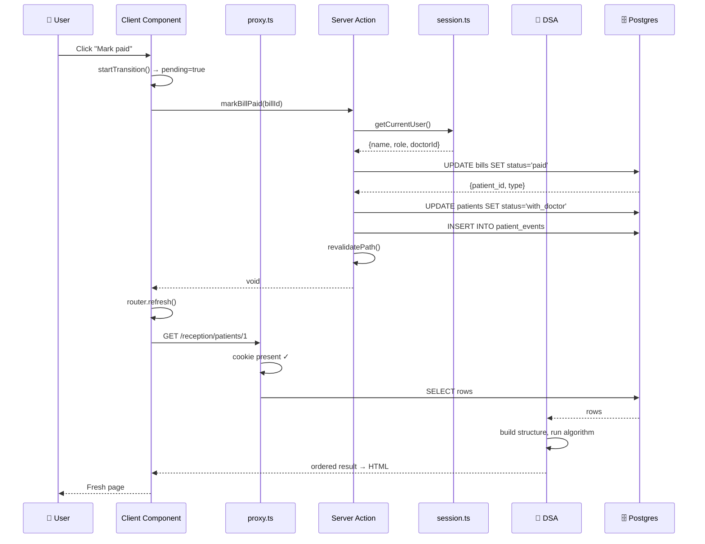

---

## 11. Known gaps & inconsistencies

Found while tracing the code. Listed newest-reader-first so you can decide what to
fix before submitting:

| # | Issue | Where | Impact |
|:---:|---|---|---|
| 1 | **DoublyLinkedList built but never read** — timeline renders via array indexing | `timeline-viewer.tsx:13–24` | Docs claim O(1) cursor walking; the structure is currently decorative. **Highest-value fix.** |
| 2 | **No bed/ward CRUD** — beds exist only via `npm run seed` | no action exists; `admin/wards/page.tsx` | Admin can't add a ward/bed without re-seeding |
| 3 | **`PatientStatus` type is out of date** — missing `follow_up` and `checkup_complete` | `lib/types.ts:3–7` | Type lies about reality; schema has 6 statuses, the type lists 4 |
| 4 | **Search interpolates a raw string into SQL** | `lib/data.ts:69` | Only strips quotes rather than parameterising, unlike every other query here |
| 5 | **`recommendAdmission` changes no state** | `actions.ts:392` | Logs an event only; reception must notice it in the timeline |
| 6 | **Operation payment deadline isn't enforced** | `actions.ts` | "Must pay before the date" is a manual check — nothing auto-reschedules an overdue op |

None of these break the demo flow. #1 and #3 are the ones a grader is most likely
to notice, and both are small fixes.

---

## 12. Quick reference

### Role → capability matrix

| Capability | 👨‍💼 Admin | 👩‍💼 Reception | 👨‍⚕️ Doctor |
|---|:---:|:---:|:---:|
| Create doctor / receptionist | ✅ | ❌ | ❌ |
| View wards & beds | ✅ (read-only) | ✅ (admit) | ❌ |
| **Add** a bed | ❌ *(seed only)* | ❌ | ❌ |
| Register patient | ❌ | ✅ | ❌ |
| Set triage severity | ❌ | ✅ | ❌ |
| Bills / concessions / payments | ❌ | ✅ | ❌ |
| Write notes, order labs/ops | ❌ | ❌ | ✅ |
| Close visit / request follow-up | ❌ | ❌ | ✅ |
| Schedule ops & follow-up dates | ❌ | ✅ | ❌ |
| Admit / discharge | ❌ | ✅ | ❌ |
| DSA Gallery | ✅ | ✅ | ✅ |

### File → responsibility

```
src/
├── proxy.ts                    Cookie gate (Next.js 16 middleware)
├── app/
│   ├── page.tsx                Redirect → role home
│   ├── login/                  Better Auth sign-in
│   └── (app)/
│       ├── layout.tsx          requireUser() + role-based nav
│       ├── admin/              Doctors CRUD · staff · wards (read-only)
│       ├── reception/          Intake · billing · FIFO queue · console
│       ├── doctor/             Priority queue · clinical console
│       └── dsa/                Gallery + live demos
├── components/
│   ├── shell.tsx               Sidebar + page chrome
│   ├── ui.tsx                  StatCard · StatusBadge · SEVERITY_LEVELS
│   └── timeline-viewer.tsx     DoublyLinkedList timeline  ⚠️ see §9.3
└── lib/
    ├── actions.ts              🔥 ALL writes (server actions)
    ├── data.ts                 All reads (queries)
    ├── routing.ts              🧮 Graph + Dijkstra + quickSort
    ├── billing.ts              💵 computeBill() — all money maths
    ├── auth.ts / session.ts    Better Auth + requireRole()
    ├── db.ts                   Postgres pool
    ├── catalog.ts              LAB_TESTS · PROCEDURES · report generator
    └── dsa/                    🧮 11 hand-written structures
```

### Demo script (5 minutes, hits every structure)

1. **Login as admin** → `/admin/doctors` → add a Cardiology doctor, rating 4.9
2. **Login as reception** → New Patient → issue **"chest pain"** →
   👀 *watch the Graph route to Cardiology and quickSort rank your new doctor first*
3. Set severity **1 (Critical)** → register → **Mark consultation paid**
4. Register a second patient, severity **5 (Routine)** → pay
5. **Login as doctor** → `/doctor/queue` →
   👀 *the critical patient is #1 even though they registered first — the min-heap at work*
6. Open the patient → add two notes (SinglyLinkedList) → order a lab test
7. **Back to reception** → bill the lab → pay → generate report → download
8. Admit to a bed → `/admin/wards` shows it 🔴 occupied → discharge → 🟢 free again
9. Walk the **timeline** Prev/Next on the patient detail page
10. **`/dsa`** → run the sort race and the triage demo

---

*Generated by reading every file in `src/`, `scripts/`, and `schema.sql`.*
